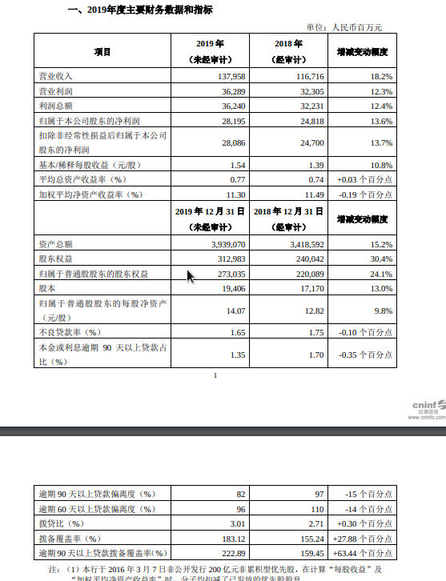
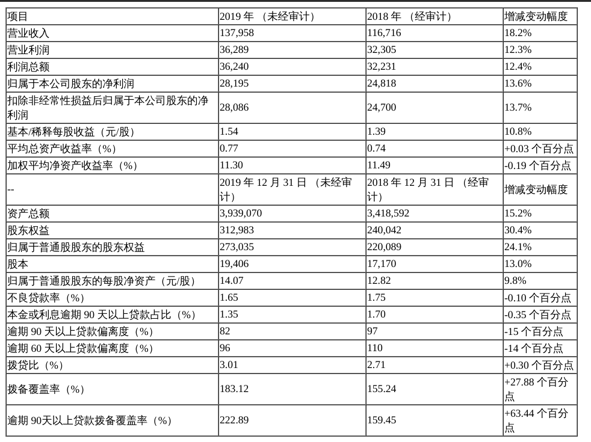

# pdf_table_parse
pdf table parse based on pdf2htmlex  implementation

* [pdf2htmlEX](https://github.com/coolwanglu/pdf2htmlEX)
* A program written a long time ago, there are still many shortcomings. I hope that more people can open source it.

> requirements
```bash
tornado
beautifulsoup4
numpy
Pillow
ztools  # 可删除
```
> docker
```bash
$ docker images
bwits/pdf2htmlex    latest
```

> run server
```bash
python pdf_to_html_to_table_server.py
```

> test
```python
import json
import base64
import requests


file_name = 'H2_AN202001131373938984_1.pdf'
with open(f"source/{file_name}", 'rb') as fIo:
    data = {
        'pdf': base64.b64encode(fIo.read()),
        'startPage': 0,
        'endPage': 10,
        'pdfName': file_name
    }
    resp = requests.post('http://127.0.0.1:13131/parser/pdf2table', data=data)
    print(json.dumps(resp.json(), ensure_ascii=False, indent=4))
    with open('source/table_{}.html'.format(file_name), 'w') as fileIo:
        content = resp.json()['all_page_tables_html']
        fileIo.write(content)
```
---
```bash
{
    "all_page_tables_html": "",
    "all_table": [],
    "pdf_name": "H2_AN202001131373938984_1.pdf",
    "code": 200,
    "message": "success"
}
```



